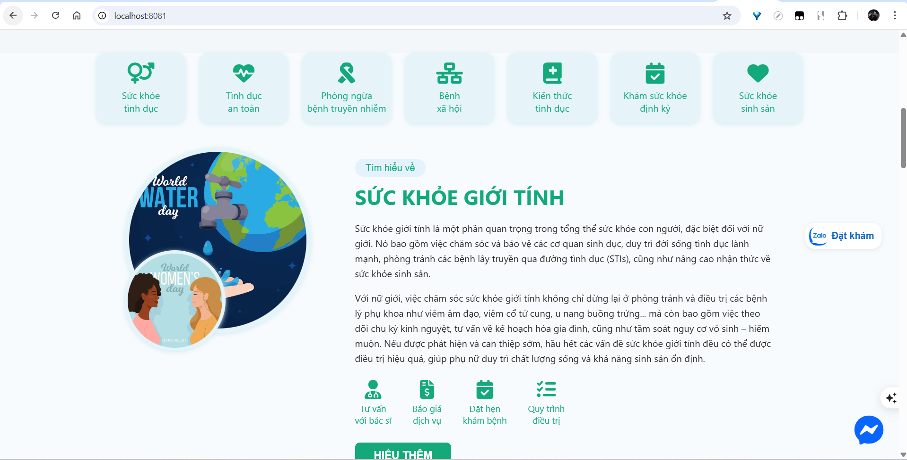
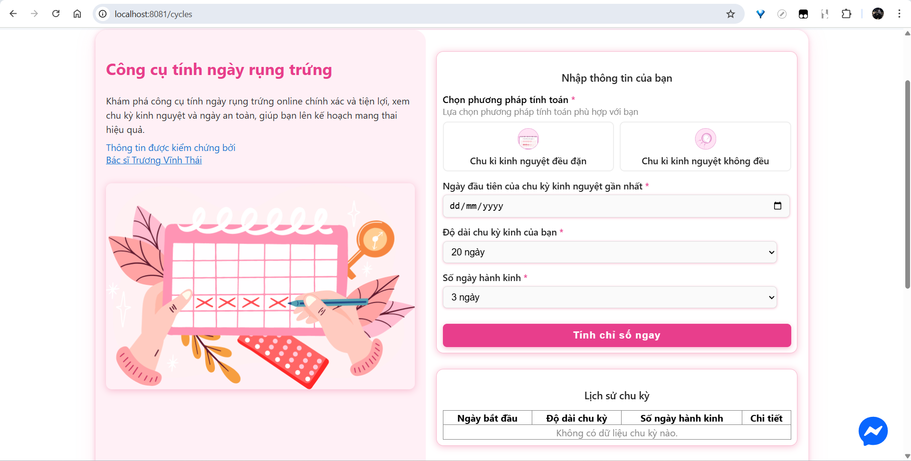
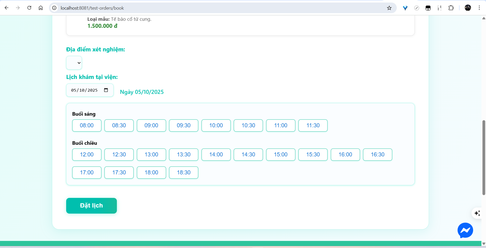
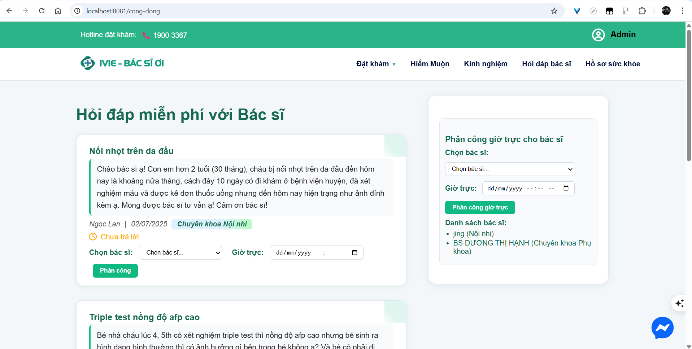
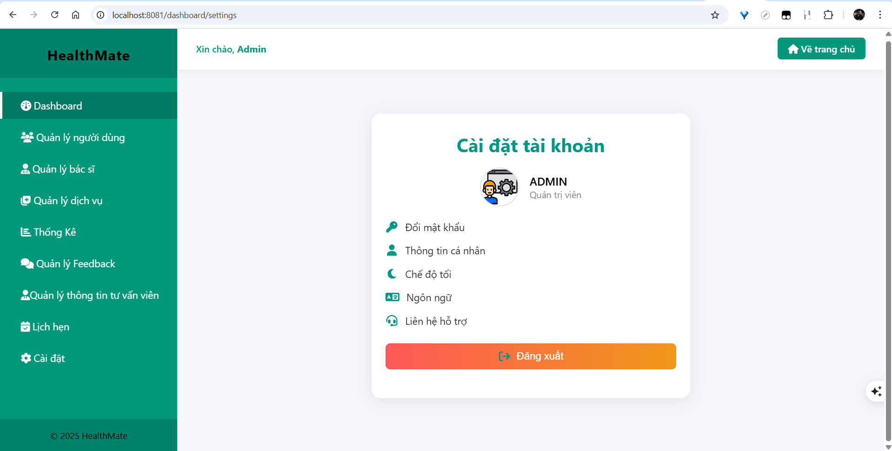

# 🏥 HealthMate - Hệ Thống Quản Lý & Chăm Sóc Sức Khỏe Sinh Sản

## 📖 Giới thiệu

**HealthMate** là hệ thống hỗ trợ chăm sóc sức khỏe sinh sản, tư vấn y tế trực tuyến và quản lý phòng khám.
Ứng dụng giúp kết nối **người dùng** với **bác sĩ**, đồng thời cung cấp cho **quản trị viên** công cụ quản lý toàn diện.
### 👉Trang người dùng
 
 
---

## 🚀 Tính năng nổi bật

### 👩‍⚕️ Người dùng

* Đặt khám online: chọn bác sĩ, cơ sở y tế, dịch vụ
* Hỏi đáp bác sĩ: chat trực tiếp với bác sĩ chuyên khoa
* Công cụ tính ngày rụng trứng, theo dõi chu kỳ kinh nguyệt
* Quản lý hồ sơ sức khỏe cá nhân, lưu trữ lịch sử khám
* Chatbot hỗ trợ 24/7: dựa trên **từ khóa** để gợi ý nội dung, dịch vụ, kiến thức sức khỏe

### 🛠️ Admin

* Quản lý người dùng
* Quản lý bác sĩ: thông tin, chuyên khoa, lịch làm việc
* Quản lý cơ sở y tế, dịch vụ chăm sóc sức khỏe
* Quản lý phản hồi (feedback)
* Quản lý lịch hẹn khám bệnh
* Thống kê dữ liệu hệ thống
* Cấu hình và cài đặt hệ thống

---

## ⚙️ Công nghệ sử dụng

| Thành phần     | Công nghệ                     |
| -------------- | ----------------------------- |
| **Backend**    | Spring Boot 3.x (Java)        |
| **Database**   | MySQL (Docker)                |
| **Frontend**   | HTML, CSS, JavaScript         |
| **Triển khai** | Docker Compose, Maven         |
| **Chatbot**    | Phân tích từ khóa, rule-based |

---

## 📂 Cấu trúc thư mục

```
src/
 └── main/
     ├── java/                # Code backend (Spring Boot)
     ├── resources/
         ├── static/
         │   ├── css/         # Giao diện CSS
         │   ├── js/          # Javascript
         │   ├── images/      # Hình ảnh minh họa
         │   └── video/       # Video demo
         ├── templates/       # Giao diện Thymeleaf
         └── application.properties
docker-compose.yml
Dockerfile
pom.xml
```

---

## 🖼️ Giao diện minh họa

### 👉Công cụ tính ngày rụng trứng

 
 

### 👉Hỏi đáp bác sĩ

 

### 👉Trang quản trị (Admin Dashboard)

 

---

## 🔧 Cài đặt & Chạy Project

### 1. Clone repo

```bash
git clone https://github.com/<NguyenHoangLe0701>/Healthmate-Care-System.git
cd Healthmate-Care-System
```

### 2. Chạy bằng Docker

```bash
docker-compose up --build
```

### 3. Truy cập

* Backend API: [http://localhost:8081](http://localhost:8081)
* MySQL: `localhost:3307` (Docker: `mysql:3307`)

---

## 📌 Tác giả

👨‍💻 Phát triển bởi: **[Nguyễn Hoàng Lê]**
📅 Năm: 2024
